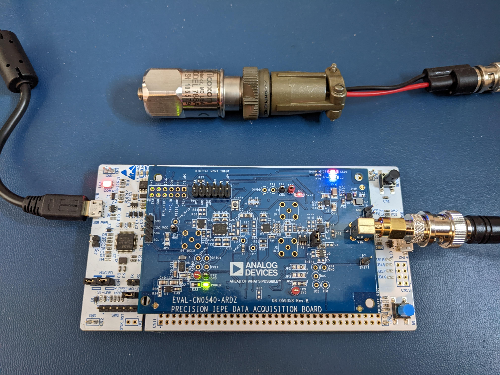
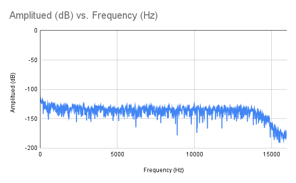
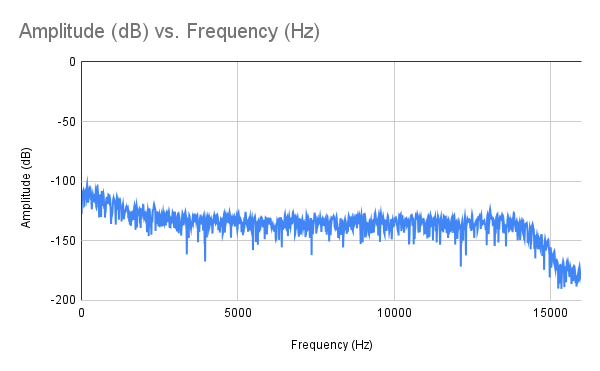
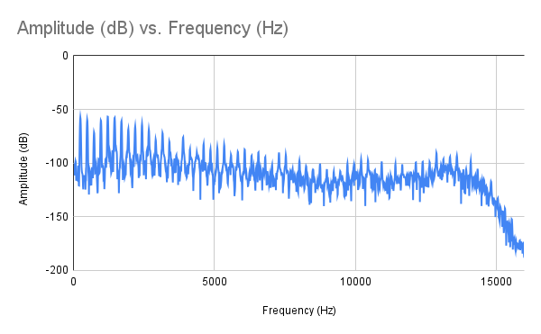

# Analog Devices EVAL-CN0540-ARDZ on STM32 Nucleo-144 with STM32L496ZG/STM32L4A6ZG MCU

I plugged a [CN-0540](https://wiki.analog.com/resources/eval/user-guides/circuits-from-the-lab/cn0540) into a [NUCLEO-L496ZG](https://www.st.com/en/evaluation-tools/nucleo-l496zg.html). 
I then ported the [Example Program](https://os.mbed.com/teams/AnalogDevices/code/EVAL-CN0540-ARDZ/shortlog/) to [STM32CubeIDE](https://www.st.com/en/development-tools/stm32cubeide.html) without Mbed. 

As a sort of verification test, I connected a 1 kΩ resistor across P1 (GND and VIN) and did 17 - Do the FFT, which yielded:

    THD:-2.038 dB
    SNR:-7.394 dB
    DR:104.990 dB
    Fundamental:-117.300 dBFS
    Fundamental:148.438 Hz
    RMS noise:25.390626 uV
    LSB noise:52.000

`12 - Read ADC master status` reports no FAULTs. Then, I did `18 - FFT settings`, `3 - Print FFT plot`, and then graphed the results:

I connected a [Wilcoxon 786A general purpose accelerometer](https://buy.wilcoxon.com/786a.html).

With the accelerometer just lying on the bench, FFT yielded:

    THD: -1.475 dB
    SNR: -1.380 dB
    DR: 98.336 dB
    Fundamental: -102.672 dBFS
    Fundamental: 179.688 Hz
    RMS noise: 83.984378 uV
    LSB noise: 172.000

I (loosely) attached a vibrator and got this:

    THD: -7.439 dB
    SNR: -4.976 dB
    DR: 51.531 dB
    Fundamental: -56.702 dBFS
    Fundamental: 1210.938 Hz
    RMS noise: 9252.442047 uV
    LSB noise: 18949.000

